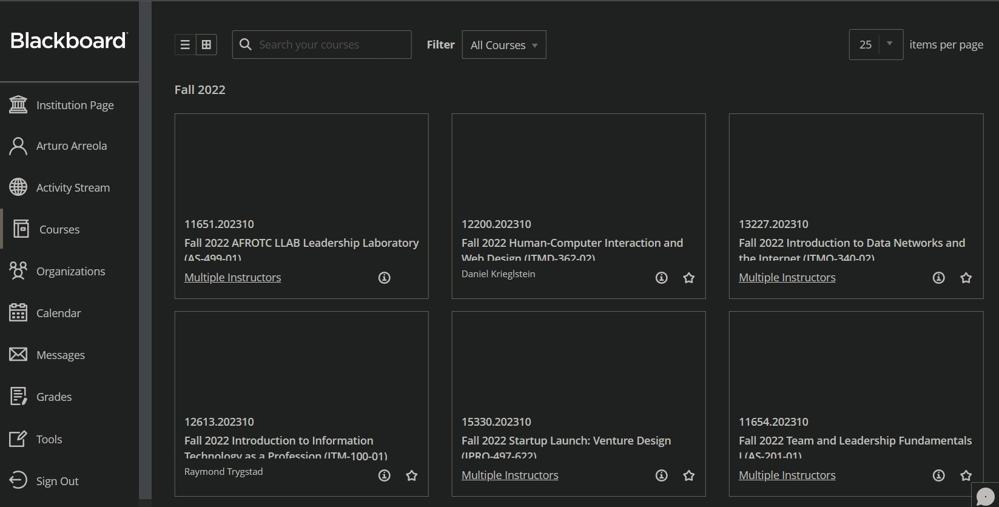
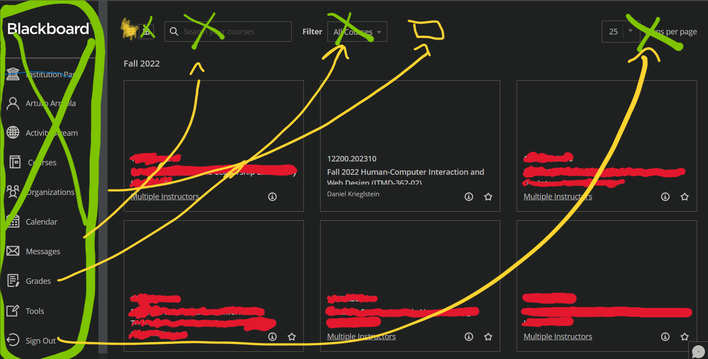
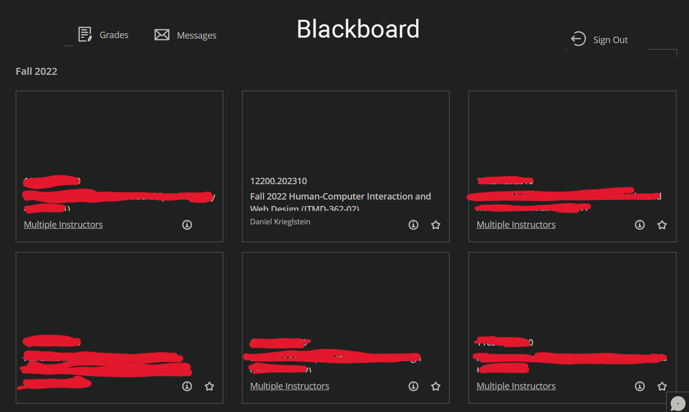

# Lab 06: Implementing HCI guidelines for touchscreens

Using the HCI guidelines from either Apple/iOS, GNOME, or Windows, redesign the 
Blackboard interface for a touch-friendly environment.

**You only need to sketch your redesign**, and in the text below, reference at least three different
points of guidance from chosen HCI guidelines that went into your redesign sketches (you might
want to do multiple sketches or mock-ups, each highlighting a different feature of the same overall design).

## Resources

* Apple iOS HCI Guidelines:
  https://developer.apple.com/design/human-interface-guidelines/platforms/designing-for-ios/
* Gnome Desktop:
  https://developer.gnome.org/hig/
* Windows Desktop Guidelines:
  https://learn.microsoft.com/en-us/windows/apps/desktop/

## Deliverables

Create a Lab 6 BaseCamp post that include:

1) Photographs of sketches (or mock-ups) of your new design.

  
2) An explanation of three different points of guidance from your chosen guidelines (point to the
   specific URL where the guidance can be found) that you implemented in your sketch, written below:

* HCI Guideline One (URL): https://developer.gnome.org/hig/principles.html
* How you implemented it in your sketch:
  The first thing i did was making the UI more appleasing to the eye. I felt that there was so much going on. there is no need for the whole left colum. the way it's setup now it opens a new page when you get into blackboard anyways. So whats the point of having ym account on there if i can just hope back to the other page? So I removed the whole left collum and moved the "Grades", "Messages" and "Sign out" to the top of the page. makes things easy to access to.

* HCI Guideline Two (URL): https://developer.apple.com/design/human-interface-guidelines/platforms/designing-for-ios/
* How you implemented it in your sketch:
  With the change on top, it also frees up space that was being wasted. making it easier for smaller mobile touch devices. bigger footprint to be able to click into select courses and such. as well as making it less clutered and more appelling on a handheld device. 

* HCI Guideline Three (URL): https://developer.apple.com/design/human-interface-guidelines/foundations/layout
* How you implemented it in your sketch:
  If a student had more than 6 classes. have it so it auto changes to a list to make things more manegable. Theres no real reason to give that option if it all fits nicely in one page with 6 or less. sometimes less is more.
